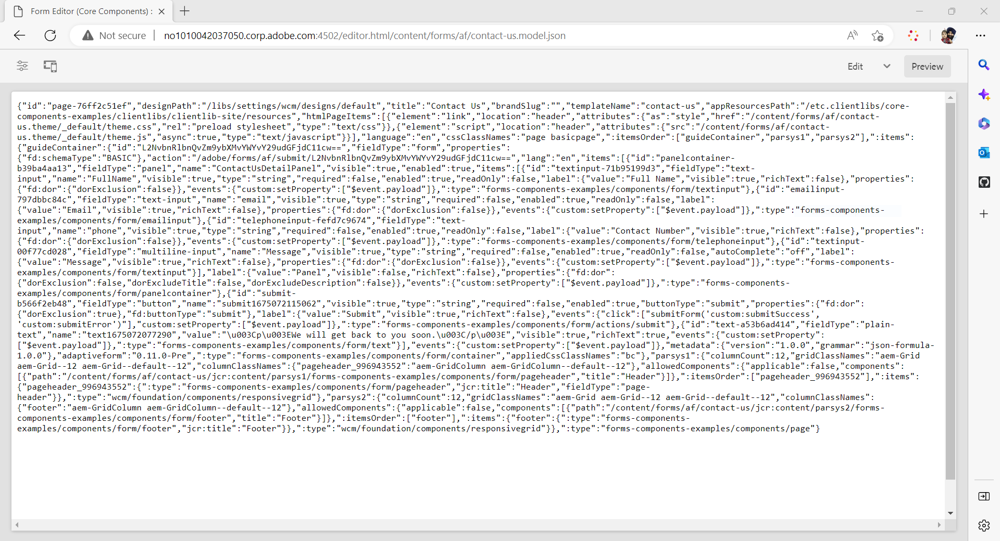

# Skapa ett Headless-formulär med Adaptive Forms editor {#create-a-headless-adaptive-form-using-adaptive-forms-editor}

AEM Forms as a Cloud Service har en användarvänlig redigerare för att skapa Headless Adaptive Forms. Med över 24 kärnkomponenter kan du enkelt skapa ett formulär genom att dra och släppa komponenter i redigeraren. I Regelredigeraren kan du dessutom lägga till valideringar i formulärfälten.

>[!NOTE]
>
> 
>Om du inte har använt Headless Adaptive Forms tidigare rekommenderar Adobe att du går igenom [Skapa och publicera ett headless-formulär med startkit](create-and-publish-a-headless-form.md) självstudiekurs om hur du lär dig grunderna och hur du skapar ett headless adaptive-formulär innan du använder Adaptive Forms editor för Headless-formulär.

Så här skapar du ett Headless-formulär med Adaptive Forms Editor:

## Innan du börjar:

Du behöver följande för att skapa ett adaptivt formulär med hjälp av den adaptiva Forms-redigeraren:

**För AEM 6.5 Forms:**

* Åtkomst till en AEM 6.5.16.0 eller senare Forms-författarinstans.

* Adaptiva Forms Core-komponenter

* Adaptiv Forms Core Components-mall

* Ett adaptivt formulärtema för en mall baserad på kärnkomponenter

* Lägg till dina användare i [!DNL forms-users] grupp. Medlemmarna i [!DNL forms-users] gruppen har behörighet att skapa ett adaptivt formulär.

**För AEM Forms as a Cloud Service:**

* Åtkomst till en [AEM Forms as a Cloud Service author-instans](https://experienceleague.adobe.com/docs/experience-manager-cloud-service/content/forms/setup-configure-migrate/setup-forms-cloud-service.html?lang=en) eller en [lokal AEM Forms as a Cloud Service SDK](https://experienceleague.adobe.com/docs/experience-manager-cloud-service/content/forms/setup-configure-migrate/setup-local-development-environment.html?lang=en) miljö.

* **En adaptiv formulärmall**: En mall innehåller en grundläggande struktur och definierar utseendet (layouter och format) för ett adaptivt formulär. Den har förformaterade komponenter som innehåller vissa egenskaper och innehållsstruktur. Här finns också alternativ för att definiera ett tema och en skicka-åtgärd. Temat definierar utseendet, känslan och skickaåtgärden definierar vilken åtgärd som ska vidtas när ett adaptivt formulär skickas in. Du kan till exempel skicka insamlade data till en datakälla. Molntjänsten tillhandahåller en OOTB-mall med namnet blank:

   * The `blank Adaptive Forms (Core Components)` -mallar ingår i alla nya as a Cloud Service AEM Forms-program.
   * Du kan också [skapa en ny adaptiv Forms-mall (kärnkomponenter)](https://experienceleague.adobe.com/docs/experience-manager-cloud-service/content/forms/adaptive-forms-authoring/authoring-adaptive-forms-foundation-components/create-an-adaptive-form-on-forms-cs/template-editor.html) från scratch.

* **Ett adaptivt formulärtema**: Ett tema innehåller formatinformation för komponenterna och panelerna. Format innehåller egenskaper som bakgrundsfärger, lägesfärger, genomskinlighet, justering och storlek. När du använder ett tema återspeglas det angivna formatet i motsvarande komponenter.  The `Canvas` -mallar ingår i alla nya as a Cloud Service AEM Forms-program.

* **Behörigheter**: Lägg till dina användare i [!DNL forms-users] grupp. Medlemmarna i [!DNL forms-users] gruppen har behörighet att skapa ett adaptivt formulär. En detaljerad lista över formulärspecifika användargrupper finns i [Grupper och behörigheter](https://experienceleague.adobe.com/docs/experience-manager-cloud-service/content/forms/setup-configure-migrate/forms-groups-privileges-tasks.html).

## Skapa ett adaptivt formulär  {#create-an-adaptive-form-components}

1. Logga in på [!DNL Experience Manager Forms] Författarinstans.

1. Ange dina uppgifter på inloggningssidan för Experience Manager. När du är inloggad trycker du på **[!UICONTROL Adobe Experience Manager]** > **[!UICONTROL Forms]** > **[!UICONTROL Forms & Documents]**.

1. Tryck på **[!UICONTROL Create]**  > **[!UICONTROL Adaptive Forms]**. Guiden öppnas. Välj en mall på fliken Källa:

   

   När du väljer en mall väljs automatiskt ett tema och en skicka-åtgärd som anges i mallen, och **[!UICONTROL Create]** knappen är aktiverad. Du kan gå till **[!UICONTROL Style]** eller **[!UICONTROL Submission]** för att välja ett annat tema eller skicka-åtgärd. Om den valda mallen inte anger något tema förblir knappen Skapa inaktiverad. Du kan gå till **[!UICONTROL Styles]** om du vill välja ett tema manuellt.

1. I **[!UICONTROL Style]** väljer du ett tema:

   * När den valda mallen anger ett tema väljs temat automatiskt i guiden. Du kan också välja ett annat tema på fliken Format.

   * Om den valda mallen inte anger något tema kan du använda fliken Format för att välja ett tema. The **[!UICONTROL Create]** knappen aktiveras först när ett tema har valts.

1. (Valfritt) Välj en datamodell på fliken Data:

   * **Formulärdatamodell**: A [Formulärdatamodell](https://experienceleague.adobe.com/docs/experience-manager-cloud-service/content/forms/integrate/use-form-data-model/data-integration.html) Med kan ni integrera enheter och tjänster från olika datakällor i ett adaptivt formulär. Välj Formulärdatamodell om det adaptiva formulär du skapar inbegriper att hämta och skriva data från och till flera datakällor.

   * **JSON-schema**: [JSON-schema](https://experienceleague.adobe.com/docs/experience-manager-cloud-service/content/forms/adaptive-forms-authoring/authoring-adaptive-forms-foundation-components/create-an-adaptive-form-on-forms-cs/adaptive-form-json-schema-form-model.html?lang=en) Adaptiv form möjliggör smidig integrering med företagets datasystem genom att ge möjlighet att associera ett JSON-schema, som representerar strukturen för de data som produceras eller konsumeras. Den här kopplingen gör det möjligt för författare att dynamiskt lägga till innehåll i det adaptiva formuläret med elementen i schemat. Elementen i schemat är enkelt tillgängliga på fliken Datamodellsobjekt i innehållsläsaren under redigeringsprocessen, och alla fält läggs automatiskt till i alla nya adaptiva formulär.

   Som standard markeras alla fält i det associerade JSON-schemat automatiskt och konverteras till motsvarande adaptiva formulärkomponenter, vilket effektiviserar redigeringsprocessen. I guiden kan du välja vilka fält som ska inkluderas i det anpassade formuläret med hjälp av kryssrutor.

1. I **[!UICONTROL Submission]** väljer du en Skicka-åtgärd:

   * När du väljer en mall markeras åtgärden Skicka som anges i mallen automatiskt. Du kan välja en annan skickaåtgärd på fliken Skicka. The **[!UICONTROL  Submission]** på -fliken visas alla tillgängliga skicka-åtgärder.

   * När den valda mallen inte anger någon skicka-åtgärd kan du använda **[!UICONTROL Submission]** flik för att välja en skicka-åtgärd

1. (Valfritt) I dialogrutan **[!UICONTROL Delivery]** kan du ange ett publicerings- eller avpubliceringsdatum för ett adaptivt formulär.

1. Tryck på **[!UICONTROL Create]**. En dialogruta där du kan ange namn, namn och plats för att spara det adaptiva formuläret visas:

   * **[!UICONTROL Title]** Anger formulärets visningsnamn. Titeln hjälper dig att identifiera formuläret i [!DNL Experience Manager Forms] användargränssnitt.
   * **[!UICONTROL Name:]** Anger formulärets namn. En nod med det angivna namnet skapas i databasen. När du börjar skriva en titel genereras värdet för namnfältet automatiskt. Du kan ändra det föreslagna värdet. Namnfältet får endast innehålla alfanumeriska tecken, bindestreck och understreck. Alla ogiltiga indata ersätts med ett bindestreck.
   * **[!UICONTROL Path:]** Anger platsen där det adaptiva formuläret ska sparas. Du kan spara det anpassade formuläret direkt på `/content/dam/formsanddocuments` eller skapa en mapp som `/content/dam/formsanddocuments/adaptiveforms` för att spara ett adaptivt formulär. Se till att du skapar mappen innan du använder den i sökvägen. The **[!UICONTROL Path]** skapas ingen mapp automatiskt.

1. Tryck på **[!UICONTROL Create]**. Ett adaptivt formulär skapas och öppnas i den adaptiva Forms-redigeraren. Redigeraren visar det innehåll som är tillgängligt i mallen.  Baserat på typen av adaptiv form finns formulärelementen i den associerade <!--XFA form template, XML schema or --> JSON-schema eller formulärdatamodell visas i **[!UICONTROL Data Model Objects]** -fliken i **[!UICONTROL Content Browser]** i sidlisten. Du kan också dra och släppa dessa element för att skapa ett anpassat formulär.

Nu kan du dra och släppa de adaptiva Forms-komponenterna till den adaptiva Forms-behållaren för att utforma och skapa formuläret.

## Visa JSON-återgivning av ett adaptivt formulär {#preview-form}

Markera det adaptiva formuläret och tryck på **Förhandsgranska**. Förhandsgranskningen av formuläret visas. Om du vill visa formulärdefinitionen (JSON) för tillägget replace.html i URL:en med .model.json

Till exempel http://[author-server]:[port]/editor.html/content/forms/af/contact-us.model.json

Du kan använda den Headless Adaptive Forms [getForm](https://opensource.adobe.com/aem-forms-af-runtime/api/#tag/Get-Form-Definition) API för att hämta formulärdefinitionen (JSON) och använda den i programmet.

