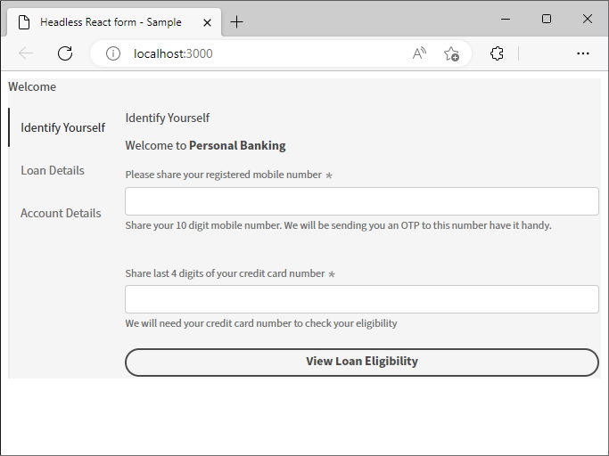
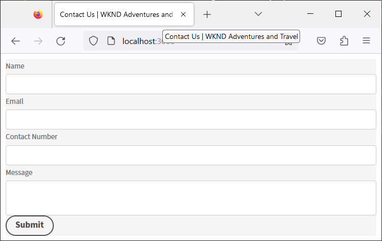

# Skapa och förhandsgranska ett Headless-formulär med en React-app {#introduction}

<!-- Missing image ALT image tags -->

Startsatsen hjälper dig att komma igång snabbt med en React-app. Du kan utveckla och använda Headless Adaptive-formulär i Angular, Vanilla JS och andra utvecklingsmiljöer.

Att börja med Headless Adaptive forms är enkelt och snabbt. Klona det färdiga React-projektet, installera beroendena och kör projektet. Du har ett Headless Adaptive-formulär som är integrerat i en React-app. Du kan använda exempelprojektet för att skapa och testa Headless Adaptive-formulär innan du distribuerar dem i en produktionsmiljö.

Låt oss börja:

>[!NOTE]
>
>
> Den här guiden för att komma igång använder en React-app. Du kan använda den teknologi eller det programmeringsspråk du föredrar för att använda Headless Adaptive-formulär.

## Innan du börjar {#pre-requisites}

Om du vill skapa och köra en React-app bör du ha följande installerat på datorn:

* Installera den [senaste versionen av Git](https://git-scm.com/downloads). Om du inte har använt Git tidigare läser du [Installera Git](https://git-scm.com/book/en/v2/Getting-Started-Installing-Git).

* Installera [Node.js 16.13.0 eller senare](https://nodejs.org/en/download/). <!-- URL is 404!! If you are new to Node.js, see [How to install Node.js](https://nodejs.dev/en/learn/how-to-install-nodejs). -->

## Kom igång

Så här kommer du igång:

1. [Startpaket för Headless Adaptive forms](#setup)

1. [Förhandsgranska den Headless Adaptive-form som ingår i startpaketet](#preview)

1. [Skapa och återge en egen Headless Adaptive-form](#custom)


## &#x200B;1. Konfigurera startpaket för Headless Adaptive forms {#install}

Startsatsen är en React-app med exempelformuläret Headless Adaptive och motsvarande bibliotek. Använd paketet för att utveckla och testa dina Headless Adaptive-formulär och motsvarande React-komponenter. Kör följande kommandon för att konfigurera startsverktyget för Headless Adaptive-formulär:

1. Öppna kommandotolken och kör följande kommando:

   ```shell
   git clone https://github.com/adobe/react-starter-kit-aem-headless-forms
   ```

   Kommandot skapar en katalog med namnet **response-starter-kit-aem-headless-forms** på din nuvarande plats och klonar startappen för Headless Adaptive forms React i den. Tillsammans med de konfigurationer och listor över beroenden som krävs för att återge formuläret innehåller katalogen följande viktiga innehåll:

   * **Exempelformulär**: Startsatsen innehåller ett exempelformulär för låneansökningar. Om du vill visa formuläret (formulärdefinitionen) som ingår i appen öppnar du filen `/react-starter-kit-aem-headless-forms/form-definations/form-model.json`.
   * **Komponenter för exempelreaktion**: Startsatsen innehåller komponenter för samplingsreaktion för RTF och Slider. Den här guiden hjälper dig att skapa egna anpassade komponenter med hjälp av dessa Rich Text- och Slider-komponenter.
   * **Mappings.ts**: Filen mappings.ts hjälper dig att mappa anpassade komponenter med formulärfält. Du kan till exempel mappa ett numeriskt nummerfält med en klassificeringskomponent.
   * **Miljökonfigurationer**: Med miljökonfigurationer kan du välja att återge ett formulär som ingår i startpaketet eller hämta ett formulär från en AEM Forms-server.

   

   >[!NOTE]
   >
   > 
   > Exemplen i dokument är baserade på VSCode. Du kan använda vilken kodredigerare som helst för oformaterad text.


1. Navigera till katalogen **responsstarter-kit-aem-headless-forms** och kör följande kommando för att installera beroendena:

   ```shell
   npm install
   ```

   Kommandot hämtar alla paket och bibliotek som behövs för att bygga och köra appen, inklusive Headless Adaptive forms libraries (@aemforms/af-response-renderer, @aemforms/af-response-components, @adobe/rea-trum). Sedan körs valideringar och data för varje formulärinstans bevaras.


   


## &#x200B;2. Förhandsgranska den Headless Adaptive-formen {#preview}

När du har konfigurerat startpaketet kan du förhandsgranska den Headless Adaptive-formen och ersätta den med en egen anpassad form. Du kan också konfigurera startsatsen för att hämta ett formulär från en AEM Forms-server. Förhandsgranska formuläret

1. Byt namn på filen `env_template` till filen `.env`. Kontrollera också att alternativet USE_LOCAL_JSON är inställt på true.

   

   <!-- The options in the .env file help you configure source of the forms definantion (.JSON):
    *  To source forms definantion (.JSON) from an AEM Server, set USE_LOCAL_JSON option to false, use the AEM_URL option to specify URL  of your AEM Server, and set the AEM_FORM_PATH option to path of your adaptive form.
    *  To source forms definantion (.JSON) form-model.json file included in the starter-kit, set USE_LOCAL_JSON option to false. -->

1. Använd följande kommando för att köra programmet:

   ```shell
     npm start
   ```


   Det här kommandot startar en lokal utvecklingsserver och öppnar exempelformuläret Headless Adaptive, som ingår i startappen, i din standardwebbläsare.

   

   Klart! Du är redo att börja utveckla en anpassad Headless Adaptive-form.

   <!--  As you know, in a headless form the form data and logic are separate from the presentation layer and can be used by any client that can make HTTP requests, such as a mobile app, a static site, or a different web application. The form is often managed and stored on a server, which serves as the backend for the form. The client sends requests to the server to retrieve the form, submit data, and receive updated form data. This allows for greater flexibility and integration with different technologies. You can store and retrive a Headless Adaptive form on an AEM Server  -->

## &#x200B;3. Skapa och återge en egen Headless Adaptive-form{#custom}

Ett Headless Adaptive-formulär representerar formuläret och dess komponenter, till exempel fält och knappar, i JSON-format (JavaScript Object Notation). Fördelen med JSON-formatet är att det enkelt kan tolkas och användas av olika programmeringsspråk, vilket gör det enkelt att utbyta formulärdata mellan system. Om du vill visa exempelformuläret Headless Adaptive som ingår i appen öppnar du filen `/react-starter-kit-aem-headless-forms/form-definations/form-model.json`.

Låt oss skapa ett `Contact Us`-formulär med fyra fält: Namn, E-post, Kontaktnummer och Meddelande. Fälten definieras som objekt (objekt) i JSON, där varje objekt (objekt) har egenskaper som typ, etikett, namn och obligatoriskt. Formuläret har också en knapp av typen &quot;skicka&quot;. Här är formulärets JSON.


```JSON
{
  "afModelDefinition": {
    "adaptiveform": "0.10.0",
    "items": [
      {
        "fieldType": "text-input",
        "label": {
          "value": "Name"
        },
        "name": "name"
      },
      {
        "fieldType": "text-input",
        "format": "email",
        "label": {
          "value": "Email"
        },
        "name": "email"
      },
      {
        "fieldType": "text-input",
        "format": "phone",
        "pattern": "[0-9]{10}",
        "label": {
          "value": "Contact Number"
        },
        "name": "Phone"
      },
      {
        "fieldType": "multiline-input",
        "label": {
          "value":"Message"
        },
        "name": "message"
      },
      {
        "fieldType": "button",
        "label":{
          "value": "Submit"
        },
        "name":"submit",
        "events":{
          "click": "submitForm()"
        }
      }
    ],
    "action": "https://eozrmb1rwsmofct.m.pipedream.net",
    "description": "Contact Us",
    "title": "Contact Us",
    "metadata": {
      "grammar": "json-formula-1.0.0",
      "version": "1.0.0"
    }
  }
}
```

>[!NOTE]
>
> * Attributet afModelDefinition behövs bara för React-program och är inte en del av formulärdefinitionen.
> * Du kan skapa ett formulär-JSON för hand eller använda [AEM adaptiva formulärredigerare (WYSIWYG-redigerare för adaptiva formulär)](create-a-headless-adaptive-form.md) för att skapa och leverera formulär-JSON. I en produktionsmiljö använder du AEM Forms för att leverera formuläret JSON, mer om det senare.
> * I självstudien används https://pipedream.com/ för att testa inskickade formulär. Du använder egna slutpunkter eller slutpunkter från tredje part som godkänts av din organisation för att ta emot data från en Headless Adaptive-form.


Om du vill återge formuläret ersätter du exempelformuläret Headless Adaptive från JSON `/react-starter-kit-aem-headless-forms/form-definations/form-model.json` med ovanstående JSON, sparar filen, väntar på att starter-kit ska kompilera och uppdatera formuläret.


<!-- Your form is ready. Let's add some validations and make "Name", "Email", and "Message" fields mandatory. -->

Du har återgett formen Headless Adaptive.


## Bonus

Vi ställer in titeln på webbsidan som är värd för formuläret till `Contact Us | WKND Adventures and Travel`. Om du vill ändra titeln öppnar du filen _react-starter-kit-aem-headless-forms/public/index.html_ för redigering och anger titeln.




## Nästa steg

Som standard används [Adobe Spectrum](https://spectrum.adobe.com/) -komponenter för att återge formuläret. Du kan skapa och använda egna komponenter eller tredjepartskomponenter. Du kan till exempel använda användargränssnittet för Google-material eller Chakra-gränssnittet.

Låt oss [använda Google-materialgränssnittet](use-google-material-ui-react-components-to-render-a-headless-form.md) för att återge formuläret `Contact Us`.


