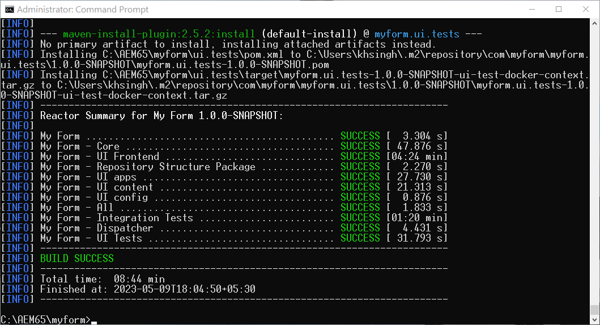

# Aktivera Headless Adaptive Forms på AEM 6.5 Forms {#enable-headless-adaptive-forms-on-aem-65-forms}

Om du vill aktivera Headless Adaptive Forms i din Forms-miljö med AEM 6.5 ska du skapa ett AEM Archetype 41 eller senare och distribuera det till alla dina Author- och Publish-instanser.

Genom att distribuera det AEM Archetype 41-projektet eller senare till dina AEM 6.5 Forms-instanser får du möjligheten att [skapa Core Components-baserade Adaptive Forms](create-a-headless-adaptive-form.md). Dessa formulär representeras i JSON-format och används som Headful and Headless Adaptive Forms, vilket ger större flexibilitet och anpassning i en rad olika kanaler, inklusive mobilappar, webbapplikationer och inbyggda appar.

## Förutsättningar {#prerequisites}

Innan du aktiverar Headless Adaptive Forms i Forms-miljö AEM 6.5

* [Uppgradera till AEM 6.5 Forms Service Pack 16 (6.5.16.0) eller senare](https://experienceleague.adobe.com/docs/experience-manager-65/release-notes/aem-forms-current-service-pack-installation-instructions.html?lang=sv-SE).

* Installera den senaste versionen av [Apache Maven](https://maven.apache.org/download.cgi).

* Installera en vanlig textredigerare. Exempel: Microsoft Visual Studio Code.

## Skapa och distribuera det senaste AEM Archetype-baserade projektet

Så här skapar du ett AEM Archetype 41- eller [senare](https://github.com/adobe/aem-project-archetype)-baserat projekt och distribuerar det till alla dina Author- och Publish-instanser:

1. Logga in på datorn som värd och kör AEM 6.5 Forms-instansen som administratör.
1. Öppna kommandotolken eller terminalen.
1. Kör följande kommando för att skapa AEM Archetype 41-baserat projekt:

   * Microsoft Windows

   ```Shell
      mvn -B org.apache.maven.plugins:maven-archetype-plugin:3.2.1:generate ^
      -D archetypeGroupId=com.adobe.aem ^
      -D archetypeArtifactId=aem-project-archetype ^
      -D archetypeVersion=41 ^
      -D appTitle="My Form" ^
      -D appId="myform" ^
      -D groupId="com.myform" ^
      -D includeFormsenrollment="y" ^
      -D aemVersion="6.5.15" 
   ```

   * Linux eller Apple macOS

   ```Shell
      mvn -B org.apache.maven.plugins:maven-archetype-plugin:3.2.1:generate \
      -D archetypeGroupId=com.adobe.aem \
      -D archetypeArtifactId=aem-project-archetype \
      -D archetypeVersion=41 \
      -D appTitle="My Form" \
      -D appId="myform" \
      -D groupId="com.myform" \
      -D includeFormsenrollment="y" \
      -D aemVersion="6.5.15" 
   ```

   Tänk på följande när du kör kommandot ovan:

   * Uppdatera kommandot så att det återspeglar de specifika värdena för miljön, inklusive appTitle, appId och groupId. Ange också värdena för includeFormsenrollment till y. Om du använder Forms Portal anger du alternativet _includeExamples=y_ för att inkludera Forms Portal Core Components i ditt projekt.

   * Ändra inte &#39;aemVersion&#39; från 6.5.15.0 till något annat.

1. (Endast för Arketype version 41-baserade projekt) När AEM Archetype-projektet har skapats kan du aktivera teman för Core Components-baserade Adaptive Forms. Så här aktiverar du teman:

   1. Öppna projektmappen [AEM Archetype]/ui.apps/src/main/content/jcr_root/apps/__appId__/components/adaptiveForm/page/customheaderlibs.html för redigering:

   1. Lägg till följande kod på rad 21:

      ```XML
      <sly data-sly-use.clientlib="core/wcm/components/commons/v1/templates/clientlib.html"
      data-sly-use.formstructparser="com.adobe.cq.forms.core.components.models.form.FormStructureParser"
      data-sly-test.themeClientLibRef="${formstructparser.themeClientLibRefFromFormContainer}">
      <sly data-sly-test="${themeClientLibRef}" data-sly-call="${clientlib.css @ categories=themeClientLibRef}"/>
      </sly>
      ```

      

   1. Spara och stäng filen.

1. Uppdatera projektet så att det innehåller den senaste versionen av Forms Core Components:

   1. Öppna projektmappen [AEM Archetype]/pom.xml för redigering.
   1. Ange version av `core.forms.components.version` och `core.forms.components.af.version` till [den senaste versionen av Forms Core Components](https://github.com/adobe/aem-core-forms-components/tree/release/650).

      

   1. Spara och stäng filen.


1. När det AEM Archetype-projektet har skapats ska du skapa distributionspaketet för din miljö. Så här skapar du paketet:

   1. Navigera till rotkatalogen för ditt AEM Archetype-projekt.


   1. Kör följande kommando för att skapa AEM Archetype-projekt för din miljö:

      ```Shell
      mvn clean install
      ```

      


   När det AEM Archetype-projektet har skapats skapas ett AEM. Paketet finns på [AEM Archetype Project Folder]\all\target\[appid].all-[version].zip

1. Använd [Package Manager](https://experienceleague.adobe.com/docs/experience-manager-65/administering/contentmanagement/package-manager.html?lang=sv-SE) för att distribuera [AEM Archetype Project Folder]\all\target\[appid].all-[version].zip-paketet på alla Author- och Publish-instanser.

>[!NOTE]
>
>
>
>Om du får problem med att komma åt inloggningsdialogrutan på en publiceringsinstans för att installera paketet via pakethanteraren kan du försöka med att logga in via följande URL: http://[Publish Server URL]:[PORT]/system/console. På så sätt kan du logga in på Publish-instansen och fortsätta med installationsprocessen.


Kärnkomponenterna är aktiverade för din miljö. En tom Core Components-baserad Adaptive Form-mall och Canvas 3.0-tema distribueras till din miljö, vilket gör att du kan [skapa Core Components-baserade Adaptive Forms](create-a-headless-adaptive-form.md).

## Vanliga frågor

### Vad är kärnkomponenter?

[Kärnkomponenterna](https://experienceleague.adobe.com/docs/experience-manager-core-components/using/introduction.html?lang=sv-SE) är en uppsättning standardiserade WCM-komponenter (Web Content Management) för AEM som snabbar upp utvecklingstiden och minskar underhållskostnaderna för dina webbplatser.

### Vad finns det för funktioner för att aktivera kärnkomponenter?


När de adaptiva Forms Core-komponenterna är aktiverade för din miljö läggs en tom Core Components-baserad Adaptive Form-mall och Canvas 3.0-tema till i din miljö. När du har aktiverat adaptiva Forms Core-komponenter för din miljö kan du:

* Skapa grundkomponentbaserade adaptiva Forms.
* Skapa grundkomponentbaserade adaptiva formulärmallar.
* Skapa egna teman för grundkomponentbaserade adaptiva formulärmallar.
* Servera Core Component-baserade Adaptive Form JSON-representationer för kanaler som mobiler, webben, inbyggda appar och tjänster som kräver att ett formulär visas utan rubrik.
