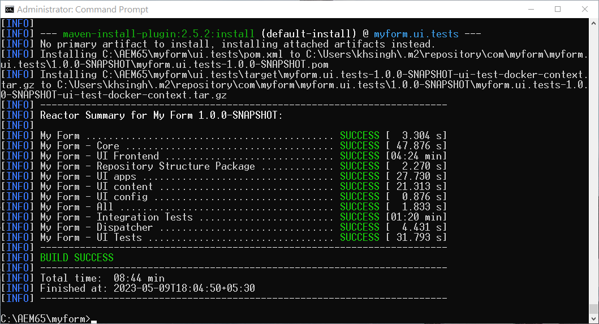

# Aktivera Headless Adaptive Forms i AEM 6.5 Forms {#enable-headless-adaptive-forms-on-aem-65-forms}

Om du vill aktivera Headless Adaptive Forms i din AEM 6.5 Forms-miljö skapar du ett projekt baserat på AEM Archetype 41 eller senare och distribuerar det till alla dina Author- och Publish-instanser.

Genom att distribuera det AEM Archetype 4.1 eller senare-baserade projektet till dina AEM 6.5 Forms-instanser får du möjligheten att [skapa Core Components-baserade Adaptive Forms](create-a-headless-adaptive-form.md). Dessa formulär representeras i JSON-format och används både som `Headful` och `Headless` Adaptiv Forms, vilket ger större flexibilitet och anpassning i en rad olika kanaler, inklusive mobilappar, webbappar och inbyggda appar.

## Förutsättningar {#prerequisites}

Innan du aktiverar Headless Adaptive Forms i AEM 6.5 Forms-miljön,

* [Uppgradera till AEM 6.5 Forms Service Pack 16 (6.5.16.0) eller senare](https://experienceleague.adobe.com/en/docs/experience-manager-65/content/release-notes/aem-forms-current-service-pack-installation-instructions).

* Installera den senaste versionen av [Apache Maven](https://maven.apache.org/download.cgi).

* Installera en vanlig textredigerare. Exempel: Microsoft Visual Studio Code.

## Skapa och driftsätt det senaste AEM Archetype-baserade projektet

Så här skapar du ett AEM Archetype 41- eller [senare](https://github.com/adobe/aem-project-archetype)-baserat projekt och distribuerar det till alla dina Author- och Publish-instanser:

1. Logga in på datorn som värd och kör din AEM 6.5 Forms-instans som administratör.
1. Öppna kommandotolken eller terminalen.
1. Kör följande kommando för att skapa ett AEM Archetype 41-baserat projekt:

   * Microsoft Windows

   ```Shell
      mvn -B org.apache.maven.plugins:maven-archetype-plugin:3.2.1:generate ^
      -D archetypeGroupId=com.adobe.aem ^
      -D archetypeArtifactId=aem-project-archetype ^
      -D archetypeVersion=41 ^
      -D appTitle="My Form" ^
      -D appId="myform" ^
      -D groupId="com.myform" ^
      -D includeFormsenrollment="y" ^
      -D aemVersion="6.5.23" 
   ```

   * Linux® eller Apple macOS

   ```Shell
      mvn -B org.apache.maven.plugins:maven-archetype-plugin:3.2.1:generate \
      -D archetypeGroupId=com.adobe.aem \
      -D archetypeArtifactId=aem-project-archetype \
      -D archetypeVersion=41 \
      -D appTitle="My Form" \
      -D appId="myform" \
      -D groupId="com.myform" \
      -D includeFormsenrollment="y" \
      -D aemVersion="6.5.23" 
   ```

   När du kör ovanstående kommando bör du tänka på följande:

   * Uppdatera kommandot så att det återspeglar de specifika värdena för miljön, inklusive appTitle, appId och groupId. Ange också värdena för includeFormsenrollment till `y`. Om du använder Forms Portal anger du alternativet _includeExamples=y_ för att inkludera Forms Portal Core Components i ditt projekt.


1. (Endast för Arketype version 4.1-baserade projekt) När AEM Archetype-projektet har skapats kan du aktivera teman för Core Components-baserade Adaptive Forms. Så här aktiverar du teman:

   1. Öppna [projektmappen AEM Archetype]/ui.apps/src/main/content/jcr_root/apps/__appId__/components/adaptiveForm/page/customheaderlibs.html för redigering:

   1. Lägg till följande kod på rad 21:

      ```XML
      <sly data-sly-use.clientlib="core/wcm/components/commons/v1/templates/clientlib.html"
      data-sly-use.formstructparser="com.adobe.cq.forms.core.components.models.form.FormStructureParser"
      data-sly-test.themeClientLibRef="${formstructparser.themeClientLibRefFromFormContainer}">
      <sly data-sly-test="${themeClientLibRef}" data-sly-call="${clientlib.css @ categories=themeClientLibRef}"/>
      </sly>
      ```

      

   1. Spara och stäng filen.

1. Uppdatera projektet så att det innehåller den senaste versionen av Forms Core Components:

   1. Öppna [projektmappen AEM Archetype]/pom.xml för redigering.
   1. Ange version av `core.forms.components.version` och `core.forms.components.af.version` till [den senaste versionen av Forms Core Components](https://github.com/adobe/aem-core-forms-components/tree/release/650).

   1. Spara och stäng filen.


1. När AEM Archetype-projektet har skapats kan du skapa distributionspaketet för din miljö. Så här skapar du paketet:

   1. Navigera till rotkatalogen för ditt AEM Archetype-projekt.


   1. Kör följande kommando för att skapa AEM Archetype-projektet för din miljö:

      ```Shell
      mvn clean install
      ```

      


   När AEM Archetype-projektet har byggts skapas ett AEM Package. Paketet finns i [AEM Archetype Project Folder]\all\target\[appid].all-[version].zip

1. Använd [Package Manager](https://experienceleague.adobe.com/en/docs/experience-manager-65/content/sites/administering/contentmanagement/package-manager) för att distribuera [AEM Archetype Project Folder]\all\target\[appid].all-[version].zip-paketet på alla Author- och Publish-instanser.

>[!NOTE]
>
>
>
>Om du får problem med att komma åt inloggningsdialogrutan på en publiceringsinstans för att installera paketet via pakethanteraren kan du försöka med att logga in via följande URL: `http://[Publish Server URL]`:[PORT]/system/console. Den här processen ger dig åtkomst till att logga in på Publishing-instansen och låter dig fortsätta med installationsprocessen.


Kärnkomponenterna är aktiverade för din miljö. En tom Core Components-baserad Adaptive Form-mall och Canvas 3.0-tema distribueras till din miljö, vilket gör att du kan [skapa Core Components-baserade Adaptive Forms](create-a-headless-adaptive-form.md).

## Vanliga frågor

### Vilka är kärnkomponenterna?

[Kärnkomponenterna](https://experienceleague.adobe.com/en/docs/experience-manager-core-components/using/introduction) är en uppsättning standardiserade WCM-komponenter (Web Content Management) för AEM som snabbar upp utvecklingstiden och minskar underhållskostnaderna för dina webbplatser.

### Vad finns det för funktioner för att aktivera kärnkomponenter?


När de adaptiva Forms Core-komponenterna är aktiverade för din miljö läggs en tom Core Components-baserad Adaptive Form-mall och Canvas 3.0-tema till i din miljö. När du har aktiverat adaptiva Forms Core-komponenter för din miljö kan du:

* Skapa grundkomponentbaserade adaptiva Forms.
* Skapa grundkomponentbaserade adaptiva formulärmallar.
* Skapa egna teman för grundkomponentbaserade adaptiva formulärmallar.
* Servera Core Component-baserade Adaptive Form JSON-representationer för kanaler som mobiler, webben, inbyggda appar och tjänster som kräver att ett formulär visas utan rubrik.
