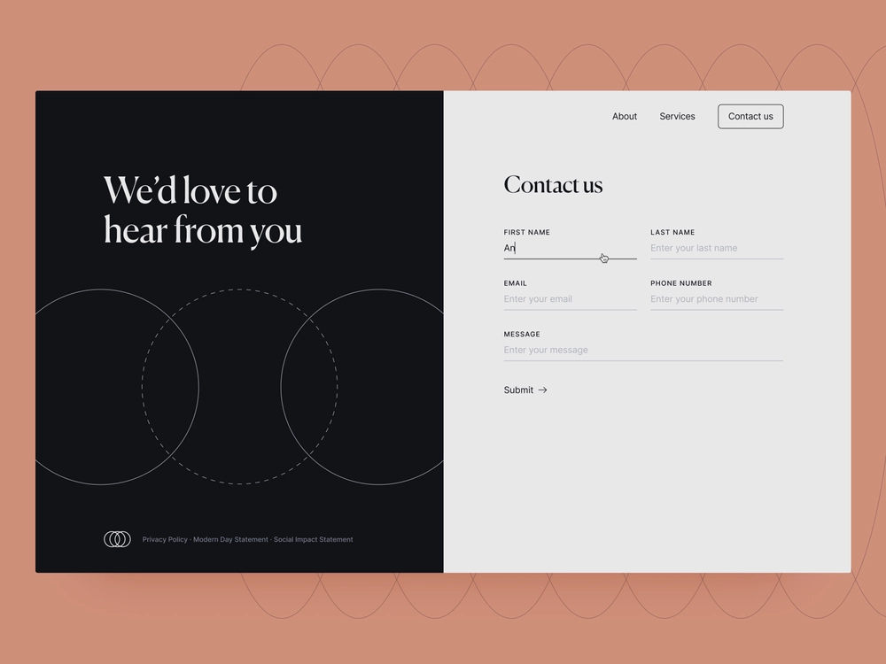

# Komma igång med Headless Adaptive Forms

Den här självstudiekursen ger dig ett komplett ramverk för att skapa ett Headless-formulär. Självstudiekursen är indelad i ett användningsfall och i flera guider. Varje guide hjälper dig att lära dig mer och lägga till nya funktioner i det Headless-anpassade formulär som skapas i kursen. Du har en fungerande Headless-anpassningsbar form efter varje guide. I slutet av den här självstudiekursen kan du göra följande:

* Skapa ett Headless-formulär
* Lägg till affärsregler i formuläret
* Använd Google materialgränssnitt för att formatera formulär
* Fyll i formuläret i förväg
* Bädda in formuläret på en webbsida

Du kommer också att bygga upp en förståelse för arkitekturen, tillgängliga artefakter och JSON-strukturen i Headless-anpassade formulär.

**Resan börjar med att lära sig användningsexemplet**:

Raya Tan, medlem av utrikesdepartementet i ett land som är känt för sin naturliga skönhet och en livskraftig turistekonomi, ansvarar för fördelningen av viseringsformulär till turister. Dessa formulär finns på avdelningens webbplats, i mobilappar och i PDF-format, med flera språkalternativ som turister kan välja bland. Att hantera och skala dessa formulär över olika plattformar och tekniker kan dock vara en utmaning.

För att förbättra effektiviteten och flexibiliteten i deras viseringsansökningsprocess har utrikesministeriet beslutat att anta en strategi för headless adaptive forms. Denna frikopplade arkitektur separerar frontend från backend-systemet, vilket ger större anpassning och skalbarhet. Avdelningen planerar att använda React-komponenterna i användargränssnittet för Google Material för att förbättra användarupplevelsen av formulären. Den kommer även att använda backend-funktioner som följande:

* Digitala signaturer
* Dataintegrering
* Affärsprocesshantering
* Dokumentation
* Användningsanalys

Den vanligaste formen bland turister är&quot;Kontakta oss&quot;, som används för att ställa olika frågor och frågor. Utrikesdepartementet har därför valt att börja tillämpa den Headless adaptive forms-metoden med detta formulär. I den här självstudiekursen får du hjälp med att skapa formuläret Kontakta oss med den nya arkitekturen. Slutresultatet ser ut så här:

