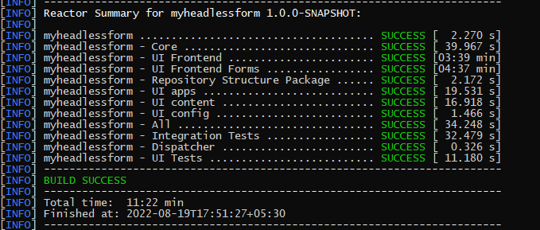
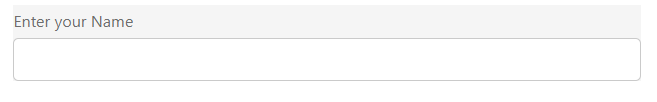

# Skapa din första anpassade Headless-form

Du kan använda Adobe Experience Manager Headless-formulär för att bygga formulärapplikationer med användargränssnitt som React och Forms Web SDK för funktioner som statshantering, validering och integrering med olika kontaktytor.

En organisation, t.ex. We.Org, vill digitalisera sin kundregistreringsresa. Deras utvecklare är mycket nöjda med att använda Angular för att bygga frontend-lösningar. De vill bygga upp en skräddarsydd front end samtidigt som de avlastar formulärvalidering och elektroniska signaturer till specialiserade lösningar.

Adobe Experience Manager Headless adaptive forms ger sådana företag frihet att skapa blanketter med hjälp av sina kunskaper i främmande språk samtidigt som de har stöd för att skapa blanketter i storföretagsklass.

<!-- >>[!VIDEO](https://video.tv.adobe.com/v/341011/) -->

<!--   -->

## Innan du börjar

* Konfigurera [utvecklingsmiljön](setup-development-environment.md) så att du kan skapa och testa ett Headless-anpassat formulär på den lokala datorn.
* Följande programvara måste vara installerad på din lokala utvecklingsdator:
   * [Java Development Kit 11](https://experience.adobe.com/#/downloads/content/software-distribution/en/general.html?1_group.propertyvalues.property=.%2Fjcr%3Acontent%2Fmetadata%2FDc%3AsoftwareType&amp;1_group.propertyvalues.operation=equals&amp;1_group.propertyvalues.0_values=software-type%3Atooling&amp;fulltext=Oracle%7E+JDK%7E+11%7E&amp;orderby=%40jcr%3Acontent%2FDK jcr%3AlastModified&amp;orderby.sort=desc&amp;layout=list&amp;p.offset=0&amp;p.limit=14)
   * [Senaste versionen av Git](https://git-scm.com/downloads). Om du inte har använt Git tidigare läser du [Installera Git](https://git-scm.com/book/en/v2/Getting-Started-Installing-Git).
   * [Node.js 16.13.0 eller senare](https://nodejs.org/en/download/). Om du inte har använt Node.js tidigare läser du [Så här installerar du Node.js](https://nodejs.dev/en/learn/how-to-install-nodejs).
   * [Maven 3.6 eller senare](https://maven.apache.org/download.cgi). Om du inte har använt Maven tidigare läser du [Installera Apache Maven](https://maven.apache.org/install.html).


## Använd arkivtypsprojektet för att skapa en Headless-blankett

Arketype-projektet är en maven-baserad mall. Det skapar ett minimalt projekt baserat på bästa praxis för att komma igång med Headless-anpassade formulär. Den innehåller även Headless adaptive forms-funktioner för Forms as a Cloud Service och lokala utvecklingsmiljöer. Det är obligatoriskt att skapa och distribuera arkivtypen 37 eller senare under betafasen. Post-beta-projektet krävs endast för anpassningar.

Så här skapar och återger du din första anpassade Headless-form:

1. [Skapa och distribuera AEM Arketype-baserat projekt](#create-an-archetype-based-project)
1. [Distribuera projektet till AEM SDK](#deploy-the-project-to-a-local-development-environment)
1. [Skapa JSON-schema med Headless-anpassningsbart formulär och överför det till din AEM SDK-instans](#create-add-json-representation-of-headless-adaptive-forms)
1. [Skapa ett adaptivt formulär baserat på mallen Tom med kärnkomponenter](#create-adaptive-form-with-blank-with-core-components-template)


### 1. Skapa och driftsätt AEM Arketype-baserat projekt {#create-an-archetype-based-project}

Beroende på vilket operativsystem du använder kör du kommandot nedan för att skapa ett as a Cloud Service Experience Manager Forms-projekt. Använd arketype version 37 eller senare. Mer information finns i [Arketype-dokumentation](https://experienceleague.adobe.com/docs/experience-manager-core-components/using/developing/archetype/overview.html) för att hitta den senaste versionen av Archetype.

**Microsoft Windows**

1. Öppna kommandotolken med administratörsbehörighet (kör kommandotolken eller bash-skalet som administratör)
1. Kör kommandot nedan:

   ```shell
     mvn -B org.apache.maven.plugins:maven-archetype-plugin:3.2.1:generate ^
     -D archetypeGroupId=com.adobe.aem ^
     -D archetypeArtifactId=aem-project-archetype ^
     -D archetypeVersion=37 ^
     -D appTitle=myheadlessform ^
     -D appId=myheadlessform ^
     -D groupId=com.myheadlessform ^
     -D includeFormsenrollment="y" ^
     -D includeFormsheadless="y" 
   ```

   * Ange `appTitle` för att definiera titel- och komponentgrupperna.
   * Ange `appId` för att definiera Maven artifactId, komponentens, konfigurations- och innehållsmappens namn samt klientbibliotekens namn.
   * Ange `groupId` för att definiera Maven groupId och Java Source Package.
   * Använd alternativet `includeFormsenrollment=y` om du vill inkludera Forms-specifika konfigurationer, teman, mallar, kärnkomponenter och beroenden som krävs för att skapa Adaptiv Forms.
   * Använd alternativet `includeFormsheadless=y` om du vill inkludera Forms Core-komponenter och beroenden som krävs för att inkludera Forms-funktionalitet utan Headless. När du aktiverar det här alternativet ingår följande:
      * Mallen **Tom med kärnkomponenter** med [kärnkomponenter](https://experienceleague.adobe.com/docs/experience-manager-core-components/using/introduction.html?lang=en).
      * En modul för frontindrag, `ui.frontend.react.forms.af`. Det hjälper dig att återge headless adaptive form i en responsapp.


**Apple macOS eller Linux**:

1. Öppna terminalen som rotanvändare. Det gör att du kan köra kommandon med administratörsbehörighet. Du kan också använda kommandot `sudo root` när du har öppnat terminalfönstret för att köra kommandon med administratörsbehörighet.
1. Kör kommandot nedan:

   ```shell
     mvn -B org.apache.maven.plugins:maven-archetype-plugin:3.2.1:generate \
     -D archetypeGroupId=com.adobe.aem \
     -D archetypeArtifactId=aem-project-archetype \
     -D archetypeVersion=37 \
     -D appTitle=myheadlessform \
     -D appId=myheadlessform \
     -D groupId=com.myheadlessform \
     -D includeFormsenrollment="y" \
     -D includeFormsheadless="y"  
   ```

   * Ange `appTitle` för att definiera titel- och komponentgrupperna.
   * Ange `appId` för att definiera Maven artifactId, komponenten, config, innehållsmappnamn och klientbiblioteksnamn.
   * Ange `groupId` för att definiera Maven groupId och Java Source Package.
   * Använd alternativet `includeFormsenrollment=y` om du vill inkludera Forms-specifika konfigurationer, teman, mallar, kärnkomponenter och beroenden som krävs för att skapa Adaptiv Forms.
   * Använd alternativet `includeFormsheadless=y` om du vill inkludera Forms Core-komponenter och beroenden som krävs för att inkludera Forms-funktionalitet utan Headless. När du aktiverar det här alternativet ingår följande:
      * Mallen **Tom med kärnkomponenter** med [kärnkomponenter](https://experienceleague.adobe.com/docs/experience-manager-core-components/using/introduction.html?lang=en).
      * Modulen `ui.frontend.react.forms.af` påverkas av en klientdel. Det hjälper dig att återge headless adaptive form i en responsapp.

När kommandot har slutförts skapas en projektmapp med det namn som har angetts i `appID`. Om du till exempel använder `appID` med värdet `myheadlessform` skapas en mapp med namnet `myheadlessform`. Det innehåller det Arketype-baserade projektet.


### 2. Distribuera projektet till AEM SDK {#deploy-the-project-to-a-local-development-environment}

När du distribuerar projektet till din AEM SDK-instans läggs funktionen Headless Adaptive Forms till, mallen **Blank with core components** och andra resurser som ingår i projektet till i din utvecklingsmiljö. <!-- Deploy the project to your local development environment to locally create Headless Adaptive Forms. or deploy directly to your Forms as a Cloud Service environment. !--> Så här distribuerar du till din AEM SDK-instans:

1. Öppna kommandotolken. Om du är i Windows öppnar du kommandotolken med administratörsbehörighet (Kör kommandotolk eller [Git bash-skalet](https://khushwantsehgal.wordpress.com/2022/06/29/check-if-git-bash-is-running-in-administrator-mode/) som administratör).

1. Navigera till projektkatalogen som skapades i föregående steg. Exempel: `/myheadlessform`

   

1. Kör följande kommando:

   ```shell
   mvn -PautoInstallPackage clean install
   ```

   Vänta på meddelandet &#39;BUILD SUCCESS&#39;.
   

   Det kan ta lång tid att lösa beroendena och distribuera projektet. Om det inte går att distribuera projektet läser du [felsökning](troubleshooting.md) i artikeln om vanliga problem och deras lösning.


<!-- *  To learn how to deploy code to AEM as a Cloud Service, see the video in [Deploying to AEM as a Cloud Service]https://experienceleague.adobe.com/docs/experience-manager-cloud-service/content/implementing/deploying/overview.html?lang=en#coding-against-the-right-aem-version) article : -->


### 3. Skapa ett JSON-schema med ett headless adaptivt format och överför det till din AEM SDK-instans {#create-add-json-representation-of-headless-adaptive-forms}

En Headless Adaptive Forms representeras som en JSON-fil. Du kan hämta ett exempelformulär från [Storybook](https://opensource.adobe.com/aem-forms-af-runtime/storybook/?path=/story/reference-examples--contact) eller använda exempelformuläret includes i Archetype Project på `[Archetype Project]\ui.content\src\main\content\jcr_root\content\dam\myheadlessform\af_model_sample.json`. Det här dokumentet använder formuläret [introduction](https://opensource.adobe.com/aem-forms-af-runtime/storybook/?path=/story/reference-examples--introduction) från Storybook. Det är ett enda fältformulär som hjälper dig att snabbt komma igång med Headless Adaptive Forms. <!-- The [specifications](/help/assets/Headless-Adaptive-Form-Specification.pdf) document provides detailed information about various components, rules, and constraints for Headless Adaptive Forms -->

Så här skapar och överför du schemat:

1. Skapa en oformaterad textfil med tillägget `.json`. Exempel: `myfirstform.json`. Du kan skapa filen var som helst i ditt filsystem eller i ditt AEM Archetype-baserade projekt på `\<project-name>\ui.content\src\main\content\jcr_root\content\dam\myheadlessform\<formname>.json`
1. Lägg till följande JSON-innehåll i din `.json`-fil och spara den:

   ```JSON
   {
     "adaptiveform": "0.10.0",
     "items": [
       {
         "fieldType": "text-input",
         "label": {
           "value": "Enter your Name"
         },
         "name": "textInput"
       }
     ],
     "metadata": {
       "grammar": "json-formula-1.0.0",
       "version": "1.0.0"
     }
   }
   ```

   Ett enskilt fält läggs till i formuläret:

   

1. Logga in på din [lokala AEM SDK-instans](setup-development-environment.md#setup-author-instance)
1. Navigera till Adobe Experience Manager > Forms > Forms och dokument. Tryck på Skapa > Filöverföring.
1. Markera `.json` som skapats i steg 2 och överför den. Du är redo att skapa den Headless Adaptive-formen. Om du sparar .json-filen i ditt AEM Archetype-baserade projekt på `\<project-name>\ui.content\src\main\content\jcr_root\content\dam\myheadlessform\<formname>.json`. Du kan använda `mvn -PautoInstallPackage clean install` för att distribuera projektet till AEM SDK och `<formname>.json` tillsammans med det.

Om det inte går att överföra `.json` kontrollerar du att [AEM Archetype-projektet har distribuerats ](#deploy-the-project-to-a-local-development-environment).

<!-- 1. Open the [contact form](https://opensource.adobe.com/aem-forms-af-runtime/storybook/?path=/story/reference-examples--contact) and tap the [](faq.md#storybook-example) icon on bottom-right side of the Storybook page to view the source code of the headless . 

You can use [Adaptive Forms builder extension for Visual Studio Code](/help/setup-development-environment.md#microsot-visual-studio-code-extension-for-headless-adaptive-forms) to build a JSON schema of your Headless Adaptive Forms. 

You can see [Storybook](https://opensource.adobe.com/aem-forms-af-runtime/storybook/?path=/story/reference-examples--introduction) for sample JSON schemas and list of components, attributes, and properties. You can also see the [specifications document](/help/assets/Headless-Adaptive-Form-Specification.pdf) for detailed information on all the components, constraints, and methods available to define Headless Adaptive Forms.

File extension of a JSON schema of Headless Adaptive Forms is .json. For example, formname.json. Create or add the file to your AEM Archetype based project. For example, `\myheadlessform\ui.content\src\main\content\jcr_root\content\dam\myheadlessform\home-loan.json` -> 

### 3. Deploy the project to a local development environment {#deploy-the-project-to-a-local-development-environment}

You can deploy the project to local development environment. It adds Headless Adaptive Forms functionality, the **Blank with core components** template, JSON schema of form, and other resources included in the project to your development environment. <!-- Deploy the project to your local development environment to locally create Headless Adaptive Forms. or deploy directly to your Forms as a Cloud Service environment. To deploy to your local development environment, use the following command: 

    `mvn -PautoInstallPackage clean install`

If you are on Windows, run the above with Administrative privileges (Run command prompt or [bash shell as an administrator](https://khushwantsehgal.wordpress.com/2022/06/29/check-if-git-bash-is-running-in-administrator-mode/)). For the complete list of commands, see [Building and Installing](https://experienceleague.adobe.com/docs/experience-manager-core-components/using/developing/archetype/using.html?lang=en#building-and-installing).
    
<!-- *  To learn how to deploy code to AEM as a Cloud Service, see the video in [Deploying to AEM as a Cloud Service]https://experienceleague.adobe.com/docs/experience-manager-cloud-service/content/implementing/deploying/overview.html?lang=en#coding-against-the-right-aem-version) article : -->

### 4. Skapa ett adaptivt formulär baserat på mallen Tom med kärnkomponenter {#create-adaptive-form-with-blank-with-core-components-template}

1. Logga in på din [AEM SDK-instans](http://localhost:4502/).

1. Navigera till Adobe Experience Manager > Forms > Forms och dokument.

1. Tryck på Skapa och välj Adaptivt formulär. Välj mallen **Tom med kärnkomponenter** och tryck på Skapa.

   

1. Ange värdena för följande egenskapsfält. Fälten Titel och Namn är obligatoriska:

   * **Titel**: Anger formulärets visningsnamn. Titeln hjälper dig att identifiera formuläret i Experience Manager Forms användargränssnitt.
   * **Namn**: Anger formulärets namn. En nod med det angivna namnet skapas i databasen. När du börjar skriva en titel genereras värdet för namnfältet automatiskt. Du kan ändra det föreslagna värdet. Namnfältet får endast innehålla alfanumeriska tecken, bindestreck och understreck. Alla ogiltiga indata ersätts med ett bindestreck.

1. Tryck på Skapa. Ett anpassat formulär skapas.

Om du inte ser mallen **Tom med kärnkomponenter** kontrollerar du att projektet [AEM Archetype har distribuerats](#deploy-the-project-to-a-local-development-environment).

### 5. Konfigurera det adaptiva formuläret så att det använder JSON-schemat {#configure-adaptive-form-to-use-the-JSON-representation}

Det adaptiva formulär som skapades i föregående steg är tomt. Konfigurera det adaptiva formuläret så att det använder JSON-schemat:

1. Logga in på din [AEM SDK-instans](http://localhost:4502/).

1. Navigera till Adobe Experience Manager > Forms > Forms och dokument. Markera det adaptiva formulär som skapades i föregående steg och tryck på Redigera. Det adaptiva formuläret öppnas i redigeraren.

1. Tryck på den adaptiva Forms-behållarkomponenten och tryck på Egenskaper. Här visas egenskapsutforskaren i sidlisten.

1. Expandera BASIC-dragspelet i egenskapsutforskaren och ange sökvägen till JSON-schemat som överförts i ett tidigare steg för alternativet Forms Runtime Document Path. Behållarkomponenten visar en återgivning av formuläret.

1. I egenskapsutforskaren expanderar du kontot Submit och anger en Submit Action (Skicka-åtgärd) för det adaptiva formuläret. Ditt formulär kan användas i en svarsapp.

1. Så här återger du formuläret på din lokala utvecklingsdator:

   1. Öppna filen `[Archetype project]\ui.frontend.react.forms.af\.env` och ange formulärsökvägen. Till exempel /content/forms/af/contact

   1. Öppna kommandotolken och navigera till projektet ui.front.rea.forms.af och kör följande kommando:

      `npm run start`

   1. När du är klar öppnar du localhost:3000 i webbläsarfönstret för att visa återgivet Headless Adaptive-formulär.
   1. Logga in på AEM Forms Server och använd alternativet **Förhandsgranska formuläret i HTML** för att öppna formuläret i förhandsgranskningsläge om du vill testa överföringsfunktionen.

[Storybook](https://opensource.adobe.com/aem-forms-af-runtime/storybook/) innehåller en lista över komponenter och regler som kan anges på olika Headless Adaptive Forms tillsammans med ett exempel på JSON-schema för Headless Adaptive Forms. Du kan även läsa i dokumentet [specifikationer](/help/assets/Headless-Adaptive-Form-Specification.pdf) om du vill veta mer om olika regler och egenskaper för Headless Adaptive Forms.
