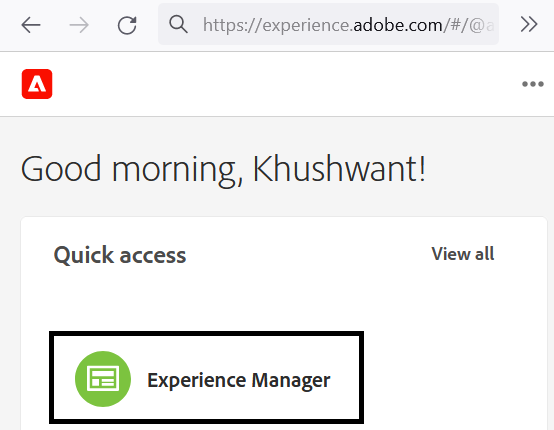
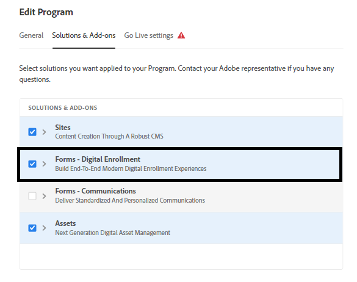
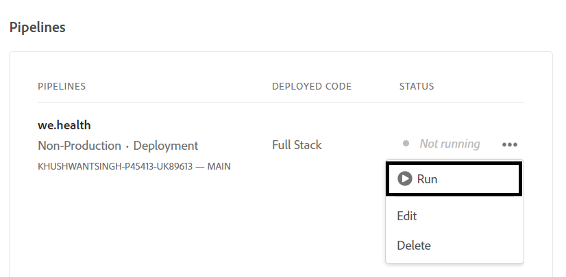

# Konfigurera utvecklingsmiljö för Headless adaptive forms på Cloud Service

<span class="preview"> Det här är en **PÅGÅENDE ARBETE**-artikel.</span>


Är du redo att skapa och testa Headless-anpassade formulär på Cloud Servicen? Aktivera Forms för er Cloud Service och komma igång.

## Innan du börjar

* Installera [den senaste versionen av Git](https://git-scm.com/downloads) på den lokala datorn. Om du inte har använt Git tidigare läser du [Installera Git](https://git-scm.com/book/en/v2/Getting-Started-Installing-Git). Du använder Git-databasen för att skicka formulären och den anpassade koden som utvecklats i den lokala utvecklingsmiljön till Cloud Servicens utvecklingsmiljö.

* Installera [Node.js 16.13.0 eller senare](https://nodejs.org/en/download/) på den lokala datorn. Om du inte har använt Node.js tidigare läser du [Så här installerar du Node.js](https://nodejs.dev/en/learn/how-to-install-nodejs).

* Skapa ett AEM as a Cloud Service-program: Följ steg 1-7 i artikeln [Skapa program](https://experienceleague.adobe.com/docs/experience-manager-cloud-service/content/onboarding/demo-add-on/create-program.html?#create-program) för att skapa ett program för din organisation.

* Aktivera [betaversionskanalen för Cloud Servicen](https://experienceleague.adobe.com/docs/experience-manager-cloud-service/content/release-notes/prerelease.html?cloud-environments).

## Konfigurera arbetsflöde

Aktivera `Forms - Digital enrolment`-lösningen för ditt AEM Cloud Service-program om du vill aktivera Headless-anpassade formulär på din Forms as a Cloud Service Sandbox, skapa ett Archetype 37-projekt eller ett senare baserat projekt på din lokala dator och skicka det till din Forms as a Cloud Service miljö. Hela processen är:


### 1. Aktivera Forms för programmet

<table style="table-layout:auto">
<tr>
  <td>
  1. Logga in på <a href="https://experience.adobe.com/" > https://experience.adobe.com/ </a> och välj alternativet <b> Experience Manager </b> .
  </td>
  <td>
    <a href="https://experienceleague.adobe.com/docs/experience-manager-cloud-service/content/onboarding/demo-add-on/create-program.html?#create-program">
      
    </a>
    <br>
  </td>
</tr>
<tr>
  <td>
  2. För alternativet <b> Cloud Manager </b> klickar du på <b> Starta. </b> En lista över program för din organisation visas.
  </td>
  <td>
    <a href="https://experienceleague.adobe.com/docs/experience-manager-cloud-service/content/onboarding/demo-add-on/create-program.html?#create-program">
      
    </a>
    <br>
  </td>
</tr>
<tr>
  <td>
    3. För ditt program trycker du på ...-ikonen och väljer alternativet <b> Redigera program </b> . En dialogruta visas. 
  </td>
  <td>
    <a href="https://experienceleague.adobe.com/docs/experience-manager-cloud-service/content/onboarding/demo-add-on/create-program.html?#create-program">
      
    </a>
    <br>
  </td>
</tr>
<tr>
  <td>
    4. Gå till fliken <b> Lösningar och tillägg </b> i dialogrutan Redigera program, välj alternativet <b> Forms - digital registrering </b> och tryck sedan på <b> update </b> . 
  </td>
  <td>
    <a href="https://experienceleague.adobe.com/docs/experience-manager-cloud-service/content/onboarding/demo-add-on/create-program.html?#create-program">
      
    </a>
    <br>
  </td>
</tr>
</table>

### 2. Klona Git-databasen för ditt program till din lokala dator

Alla AEM as a Cloud Service-program har en Git-databas. Med den kan du överföra anpassad kod och resurser från den lokala datorn till din Cloud Service. Under installationen använder vi Git-databasen för att ta med kod, mallar och annan information för Headless-formulär från din lokala Cloud Service. Klona Cloud Servicens Git-databas på den lokala datorn är det första steget mot att överföra anpassad kod och innehåll från den lokala datorn till Cloud Servicen.

>[!INFO]
>
> Du kan alltid implementera en Git-databas utan att klona den. Men den har sina egna frågetecken. Vi använder kloningsmetoden i det här dokumentet.


Så här klonar du databasen:

<table style="table-layout:fixed">
<tr>
  <td>
  1. Tryck på <b> för att få åtkomst till informationen om svar i programmets pipeline. </b> En dialogruta med databasinformation visas 
  </td>
  <td>
    <a href="https://experienceleague.adobe.com/docs/experience-manager-cloud-service/content/onboarding/demo-add-on/create-program.html?#create-program">
      
    </a>
    <br>
  </td>
</tr>
<tr>
  <td>
  2. Tryck på <b> Generera lösenord </b> och kopiera <b> databas-URL:en. </b> 
  </td>
  <td>
      
    <br>
  </td>
</tr>
<tr>
  <td>
    3. Öppna kommandotolken på den lokala datorn, skapa en mapp och kör följande kommando och ange databasens autentiseringsuppgifter. Fråga:
    </br>
    <code> git clone [Repository URL] </code> </br></br>
    Till exempel: </br> 
    <code> git clone https://git.cloudmanager.adobe.com/stage-aemformsdev/khushwantsingh-p45413-uk89613/ </code>

</br> Hämta <b> användarnamn </b> och <b>lösenord</b> från skärmen <b>Databasinformation</b> när du tillfrågas.
</td>
  <td>
     
  </td>
</tr>
</table>


### 3. Skapa ett AEM Archetype-baserat projekt

Arketype-projektet är en maven-baserad mall. Det skapar ett minimalt projekt baserat på bästa praxis för att komma igång med Headless-anpassade formulär. Det innehåller även basfunktioner för Headless-anpassade formulär för Forms as a Cloud Service. Det är obligatoriskt att skapa och distribuera det arkitekturbaserade projektet 37 eller senare.
®®
Beroende på vilket operativsystem du använder kör du kommandot maven för att skapa ett as a Cloud Service Experience Manager Forms-projekt. Använd arketype version 37 eller senare. Se [Arketype-dokumentation](https://experienceleague.adobe.com/docs/experience-manager-core-components/using/developing/archetype/overview.html) för att hitta den senaste versionen av Archetype.

+++ Microsoft® Windows

1. Öppna kommandotolken med administratörsbehörighet (Kör kommandotolken eller bash-skalet som administratör).
1. Kör kommandot nedan:

   ```shell
     mvn -B org.apache.maven.plugins:maven-archetype-plugin:3.2.1:generate ^
     -D archetypeGroupId=com.adobe.aem ^
     -D archetypeArtifactId=aem-project-archetype ^
     -D archetypeVersion=37 ^
     -D appTitle=myheadlessform ^
     -D appId=myheadlessform ^
     -D groupId=com.myheadlessform ^
     -D includeFormsenrollment="y" ^
     -D includeFormsheadless="y" 
   ```

™™
* Ange `appTitle` för att definiera titel- och komponentgrupperna.
* Ange `appId` för att definiera Maven artifactId, komponentens, konfigurations- och innehållsmappens namn samt klientbibliotekens namn.
* Ange `groupId` för att definiera Maven groupId och Java™ Source Package.
* Använd alternativet `includeFormsenrollment=y` om du vill inkludera Forms-specifika konfigurationer, teman, mallar, kärnkomponenter och beroenden som krävs för att skapa Adaptiv Forms.
* Använd alternativet `includeFormsheadless=y` om du vill inkludera Forms Core-komponenter och beroenden som krävs för att inkludera funktionen för Headless-anpassade formulär. När du aktiverar det här alternativet ingår följande:\
* Mallen **Tom med kärnkomponenter** med [kärnkomponenter](https://experienceleague.adobe.com/docs/experience-manager-core-components/using/introduction.html?lang=en).
* En modul för frontindrag, `ui.frontend.react.forms.af`. Det hjälper dig att återge Headless-formulär i en responsapp.

+++®®


+++ Apple macOS eller Linux®

1. Öppna terminalen som rotanvändare. Det gör att du kan köra kommandon med administratörsbehörighet. Du kan också använda kommandot `sudo root` när du har öppnat terminalfönstret för att köra kommandon med administratörsbehörighet.
1. Kör kommandot nedan:

   ```shell
     mvn -B org.apache.maven.plugins:maven-archetype-plugin:3.2.1:generate \
     -D archetypeGroupId=com.adobe.aem \
     -D archetypeArtifactId=aem-project-archetype \
     -D archetypeVersion=37 \
     -D appTitle=myheadlessform \
     -D appId=myheadlessform \
     -D groupId=com.myheadlessform \
     -D includeFormsenrollment="y" \
     -D includeFormsheadless="y"  
   ```

™™
* Ange `appTitle` för att definiera titel- och komponentgrupperna.
* Ange `appId` för att definiera Maven artifactId, komponenten, config, innehållsmappnamn och klientbiblioteksnamn.
* Ange `groupId` för att definiera Maven groupId och Java™ Source Package.
* Använd alternativet `includeFormsenrollment=y` om du vill inkludera Forms-specifika konfigurationer, teman, mallar, kärnkomponenter och beroenden som krävs för att skapa Adaptiv Forms.
* Använd alternativet `includeFormsheadless=y` om du vill inkludera Forms Core-komponenter och beroenden som krävs för att inkludera funktionen för Headless-anpassade formulär. När du aktiverar det här alternativet ingår följande:\
* Mallen **Tom med kärnkomponenter** med [kärnkomponenter](https://experienceleague.adobe.com/docs/experience-manager-core-components/using/introduction.html?lang=en).
* Modulen `ui.frontend.react.forms.af` för att reagera framåt. Det hjälper dig att återge Headless-formulär i en responsapp.

+++

När kommandot har slutförts skapas en projektmapp med det namn som har angetts i `appID`. Om du till exempel använder `appID` med värdet `myheadlessform` skapas en mapp med namnet `myheadlessform`. Det innehåller det Arketype-baserade projektet.

### 4. Skicka det AEM Arketype-baserade projektet till Cloud Servicen

1. Ersätt Git-databasens innehåll med innehållet i ett Archtype-baserat projekt.

   >[!VIDEO](https://video.tv.adobe.com/v/3409809/)

1. Öppna kommandotolken, navigera till din Git-databasmapp och kör nedanstående kommandon i den ordning som visas för att överföra det ersatta innehållet till din Cloud Service-miljö. Du kan också använda en visuell redigerare i stället för att använda kommandona nedan för att överföra innehåll till Cloud Servicens databas.

   ```
      git add .
      git commit
      git push origin
   ```

### 5. Kör byggpipeline för ditt program


<table style="table-layout:auto">
<tr>
  <td>
  1. Logga in på <a href="https://experience.adobe.com/" > https://experience.adobe.com/ </a> och välj alternativet <b> Experience Manager </b> .
  </td>
  <td>
    <a href="https://experienceleague.adobe.com/docs/experience-manager-cloud-service/content/onboarding/demo-add-on/create-program.html?#create-program">
      
    </a>
    <br>
  </td>
</tr>
<tr>
  <td>
  2. För alternativet <b> Cloud Manager </b> klickar du på <b> Starta. </b> En lista över program för din organisation visas. Öppna programmet. 
  </td>
  <td>
    <a href="https://experienceleague.adobe.com/docs/experience-manager-cloud-service/content/onboarding/demo-add-on/create-program.html?#create-program">
      
    </a>
    <br>
  </td>
</tr>
<tr>
  <td>
    3. Tryck på ikonen ... för din pipeline och välj alternativet <b> Kör </b> . Om du uppmanas att köra pipelinen trycker du på <b> Kör </b> och väntar på pipelinans <b> status </b> för att ändra till <b> Slutförd </b>.  
  </td>
  <td>
    <a href="https://experienceleague.adobe.com/docs/experience-manager-cloud-service/content/onboarding/demo-add-on/create-program.html?#create-program">
      
    </a>
    <br>
  </td>
</tr>
</table>

Nu kan du börja använda Headless-formulär. Du kan nu överföra JSON-definitionen för ett formulär till din formulärmiljö, skapa ett Headless-anpassat formulär baserat på det och använda [getForm](https://opensource.adobe.com/aem-forms-af-runtime/api/#tag/Get-Form-Definition/operation/getForm) och andra rest-API:er för att använda det Headless-anpassade formuläret i ditt program eller din Cloud Service.
