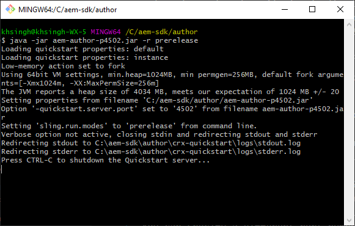

# Konfigurera en lokal utvecklingsmiljö {#headless-adaptive-forms-setup-development-environment}

Du kan konfigurera en lokal utvecklingsmiljö för att skapa och testa Headless-formulär på din lokala dator. Utvecklingsmiljön består av AEM SDK och AEM Forms Feature Archive som är installerade AEM SDK.
<!--
 After a Headless adaptive form or related assets are ready on the local development environment, you can deploy the Headless adaptive form application to your publishing environment. -- >

You require knowledge to build application using react, Git, and Maven to use Headless adaptive forms.

<!-- 

### Download the latest version of AEM as a Cloud Service SDK or Forms feature archive (AEM Forms add-on) from Software Distribution {#software-distribution}

To download the supported version of Adobe Experience Manager as a Cloud Service SDK or Forms feature archive (AEM Forms add-on):

1. Log in to [Software Distribution](https://experience.adobe.com/#/downloads) portal with your Adobe ID.

    >[!NOTE]
    >
    > Your Adobe Organization must be provisioned for AEM as a Cloud Service to download the AEM as a Cloud Service SDK.

1. Navigate to the **[!UICONTROL AEM as a Cloud Service]** tab.
1. Sort by published date in descending order.
1. Click on the latest Adobe Experience Manager as a Cloud Service SDK or Forms feature archive (AEM Forms add-on).
1. Review and accept the EULA. Tap the **[!UICONTROL Download]** button. -->

## Systemkrav {#headless-adaptive-forms-system-requirements}

För att installera AEM SDK måste din lokala dator uppfylla följande minimikrav:

* [Java Development Kit 11](https://experience.adobe.com/#/downloads/content/software-distribution/en/general.html?1_group.propertyvalues.property=.%2Fjcr%3Acontent%2Fmetadata%2FDc%3AsoftwareType&amp;1_group.propertyvalues.operation=equals&amp;1_group.propertyvalues.0_values=software-type%3Atooling&amp;fulltext=Oracle%7E+JDK%7E+11%7E&amp;orderby=%40jcr%3Acontent%2FDK jcr%3AlastModified&amp;orderby.sort=desc&amp;layout=list&amp;p.offset=0&amp;p.limit=14)
* [Senaste versionen av Git](https://git-scm.com/downloads). Om du inte har använt Git tidigare läser du [Installera Git](https://git-scm.com/book/en/v2/Getting-Started-Installing-Git).
* [Node.js 16.13.0 eller senare](https://nodejs.org/en/download/). Om du inte har använt Node.js tidigare läser du [Så här installerar du Node.js](https://nodejs.dev/en/learn/how-to-install-nodejs).
* [Maven 3.6 eller senare](https://maven.apache.org/download.cgi). Om du inte har använt Maven tidigare läser du [Installera Apache Maven](https://maven.apache.org/install.html).

## Konfigurera utvecklingsmiljö {#headless-adaptive-forms-procedure-to-setup-development-environment}

Så här konfigurerar du en ny lokal utvecklingsmiljö och använder den för att utveckla och testa Headless-adaptiva formulär:

1. [Konfigurera AEM as a Cloud Service SDK](#setup-author-instance).
1. [Lägg till AEM Forms-arkiv (AEM Forms Cloud Service-tillägg) i AEM SDK](#add-forms-archive).

<!--

1. (Optional) [Add Forms-specific users to your local Author instance](#configure-users-and-permissions).
1. (Optional) Install [Adaptive forms builder extension for Microsoft Visual Studio Code](#microsoft-visual-studio-code-extension-for-headless-adaptive-forms). 

-->

### 1. Konfigurera AEM as a Cloud Service SDK {#setup-author-instance}

AEM as a Cloud Service SDK (AEM SDK) ger utvecklare lokal erfarenhet av att skapa och testa Headless-formulär. Du kan använda AEM as a Cloud Service SDK för att både skapa och förhandsgranska Headless-formulär, vilket gör att du kan utföra de flesta valideringar som är kopplade till utvecklingen lokalt. Så här konfigurerar du en lokal författarinstans:

1. [Hämta](https://experience.adobe.com/#/downloads/content/software-distribution/en/aemcloud.html) den senaste [!DNL Adobe Experience Manager] as a Cloud Service SDK. Använd kolumnen Publicerat för att sortera och enkelt hitta den senaste SDK:n.
Det är i ZIP-format. Versionen som stöds är aem-sdk-2022.7.8085.20220725T140323Z-220700.zip och senare.

   


1. Extrahera den hämtade ZIP-filen till en katalog på den lokala datorn.
1. Skapa en katalog på den lokala datorn som fungerar som installationsplats för författarinstansen. Exempel: `~/aem-sdk/author`.
1. Kopiera .jar-filen från extraherade SDK-filer till installationsplatsen och byt namn på filen till `aem-author-p4502.jar`. Strängen `p4502` i filnamnet anger vilket portnummer som ska användas. Du kan även ange ett annat portnummer.

   >[!NOTE]
   >
   > Dubbelklicka inte på .jar-filen för att starta den. Det resulterar i ett [fel](https://experienceleague.adobe.com/docs/experience-manager-learn/cloud-service/local-development-environment-set-up/aem-runtime.html?lang=sv-SE#troubleshooting-double-click).

1. Öppna kommandotolken:
   * I Windows använder du alternativet **Kör som administratör** för att öppna kommandotolken i förhöjt läge.
   * I Linux måste du öppna terminalfönstret som rotanvändare.

1. Navigera till installationsplatsen som innehåller den kopierade .jar-filen och kör följande kommando:

   `java -jar aem-author-p4502.jar -r prerelease`

   

   * `-r prerelease`-växeln aktiverar funktioner som bara är tillgängliga i förhandsversionen och i begränsade versioner.
   * Du kan använda `admin` som användarnamn och lösenord för lokal utveckling för att minska den kognitiva belastningen.

   När AEM har startats öppnas inloggningssidan i webbläsaren. Du kan även öppna inloggningssidan för AEM SDK-instans på adressen `http://localhost:<port>` i webbläsaren. Exempel: [http://localhost:4502](http://localhost:4502).

1. Logga in på din Author-instans. Tryck på ikonen , tryck på Om Adobe Experience Manager och kontrollera att versionsnumret innehåller postfixet PRERELEASE.

   

Om du inte ser prefixet för PRERELEASE stoppar du servern, tar bort `[AEM SDK installation]/crx-quickstart folder` och startar om AEM SDK.jar-filen med `-r prerelease` -växeln. Mer alternativ finns i [Felsökning](/help/troubleshooting.md).

### 2. Lägg till AEM Forms-arkiv (AEM Forms Cloud Service-tillägg) i AEM SDK {#add-forms-archive}

AEM Forms as a Cloud Service feature archive (AEM Forms Cloud Service add-on) innehåller verktyg för att skapa Headless-anpassade formulär i en lokal utvecklingsmiljö. Så här installerar du funktionsarkivet:

1. Hämta och extrahera det senaste [!DNL AEM Forms]-funktionsarkivet (AEM Forms-tillägg) från [Programvarudistribution](https://experience.adobe.com/#/downloads/content/software-distribution/en/aemcloud.html?fulltext=AEM*+Forms*+add*+on*&amp;orderby=%40jcr%3Acontent%2Fjcr%3AlastModified&amp;orderby.sort=desc&amp;layout=list&amp;p.offset=0&amp;p.limit=20). Använd kolumnen Publicerat för att sortera och enkelt hitta den senaste SDK:n. Versionen som stöds är aem-forms-addon-2022.07.06.02-220600 och senare.

1. Navigera till katalogen crx-quickstart/install. Om mappen inte finns skapar du den.
1. Stoppa din AEM SDK-instans. Du kan avsluta det kommandotolkfönster som kör AEM SDK-instans för att stoppa AEM.
1. Kopiera arkivet med tilläggsfunktioner för [!DNL AEM Forms] från filen `aem-forms-addon-<version>.far`, som extraherats i steg 1, till installationsmappen.
1. Använd följande kommando för att starta om AEM SDK-instansen:

   `java -jar aem-author-p4502.jar -r prerelease`

<!-- 

### 3. (Optional) Configure users and permissions {#configure-users-and-permissions}

Create seperate user accounts for Form Developer, Form Practitioner, and end users. These account help you test Headless adaptive forms for various types of users. To create a user account and add roles to the account:

1. Login to your AEM SDK instance.
1. Go to Tools > Security > Users and tap Create. The Create New User wizard opens.
1. In the details tab, specify an ID and Password. All other fields are optional. It is recommended to provide name and an email address.
1. In the Groups tab, search and select user-groups for a user depending on their role. The table below lists all types of users and pre-defined groups for each type of forms users based on their role:
  
    | User Type | AEM Group |
    |---|---|
    | Form developer | [!DNL forms-users] (AEM Forms Users), [!DNL template-authors], [!DNL workflow-users], [!DNL workflow-editors], and [!DNL fdm-authors]  |
    | Customer Experience Lead or UX Designer| [!DNL forms-users], [!DNL template-authors]|
    | AEM administrator | [!DNL aem-administrators], [!DNL fd-administrators] |
    | End user| When a user must log in to view and submit an Adaptive Form, add such users to [!DNL forms-users] group. </br> When no user authentication is required to access Adaptive Forms, do not assign any group to such users.|

<!-- ### 4. (Optional) Install Visual Studio Code extension for Headless adaptive forms {#microsoft-visual-studio-code-extension-for-headless-adaptive-forms}

You can use any IDE for developing Headless adaptive forms. Adobe provides an extension for Microsoft&reg;reg; Visual Studio Code to make it easier for you to navigate structure and develop Headless adaptive forms. The extension adds adaptive forms related IntelliSense capabilities and helps auto-complete Headless adaptive forms JSON syntax. It also adds a panel, titled Forms Tree, to help navigate structure of Headless adaptive form. To use the extension: 

1. Ensure [Microsoft Visual Studio Code 1.62.0 or later](https://code.visualstudio.com/docs/supporting/FAQ#_how-do-i-find-the-version) is installed. If you have an older version or no version installed, download the latest version from [Microsoft Website](https://code.visualstudio.com/docs/setup/setup-overview)
   >[!NOTE]
   >
   >
   > To use Visual Studio from command line on macOS, see [Launching from the command line](https://code.visualstudio.com/docs/setup/mac#_launching-from-the-command-line).

1. Download the [Adaptive forms builder extension](/help/assets/adaptive-form-builder-0.12.0.vsix).

1. Navigate the directory containing the *adaptive-form-builder-[version].vsix* file.

1. Run the following command or see [Install from a VSIX](https://code.visualstudio.com/docs/editor/extension-marketplace#_install-from-a-vsix) article for detailed instructions to install a Visual Studio Code extension from a VSIX file:

    `code -–install-extension adaptive-form-builder-[version].vsix`

    </br> Replace the [version] with actual version of the extension. For example, `code -–install-extension adaptive-form-builder-0.12.0.vsix`

    </br> 

    

<!-- ## Create and setup a react app

Adaptive forms renderer component is a react based component. It requires a react app to run and render a Headless adaptive form. To create and setup react app:

1. Open terminal in Visual Studio code and run the following command to create a react app and installs all related dependencies:

    ```shell
    npx create-react-app [react-app-name] --scripts-version 4.0.3 --template typescript
    ```

    Where [react-app-name] represents name of the project, script version is 4.0.3, and template of type typescript. For example, the following command creates a react app named *headless-forms-demo*.

    ```shell
    npx create-react-app headless-forms-demo --scripts-version 4.0.3 --template typescript
    ```

    It may take some time to create the react app and install all the dependencies. The command creates an empty react app with latest version of react and react-dom dependencies. It does not have any artifacts related to adaptive forms renderer component.

1. Adaptive forms renderer component is based on react spectrum and requires react 16.0.0 and react-dom 16.0.0. To install react 16.0.0 and related dependencies:
    1. Open the Visual Studio code terminal Window or command prompt.
    1. Navigate to the directory of react project.  
    1. Run the following command:

        ```shell
        npm install --save react@16.0.0 react-dom@16.14.0 -force
        ```

1. Run the following command to install adaptive forms renderer component related dependencies:

    ```shell
    npm i --save @aemforms/forms-super-component @aemforms/forms-react-core-components @aemforms/forms-super-component @adobe/react-spectrum @react/react-spectrum
    ```

<!-- 1. Install dependencies for adaptive forms renderer component. Packages for these dependencies are available in Adobe Artifactory. To authenticate with Adobe Artifactory and install dependencies for adaptive forms renderer component:

    1. Create environment variables ARTIFACTORY_USER and ARTIFACTORY_API_TOKEN. The ARTIFACTORY_USER stores Adobe LDAP username and ARTIFACTORY_API_TOKEN stores your [Adobe Artifactory token](https://wiki.corp.adobe.com/display/Artifactory/API+Keys)

    1. Run the following command to set NPM_TOKEN and NPM_EMAIL tokens:

        ```shell

        auth=$(curl -s -u${ARTIFACTORY_USER}:${ARTIFACTORY_API_TOKEN} https://artifactory.corp.adobe.com/artifactory/api/npm/auth)
        export NPM_TOKEN=$(echo "${auth}" | grep "_auth" | awk -F " " '{ print $3 }')
        export NPM_EMAIL=$(echo "${auth}" | grep "email" | awk -F " " '{ print $3 }')
        ```

        These tokens are required to communicated with Adobe Artifactory.

    1. Create a .npmrc file in the react project.

        

    1. Add the following code to the file:

        ```shell
        @aemforms:registry=https://artifactory.corp.adobe.com/artifactory/api/npm/npm-aem-release/
        @react:registry=https://artifactory.corp.adobe.com/artifactory/api/npm/npm-react-release/
        @quarry:registry=https://artifactory.corp.adobe.com/artifactory/api/npm/npm-adobe-release-local/
        //artifactory.corp.adobe.com/artifactory/api/npm/npm-adobe-release-loca/:_auth=${NPM_TOKEN}
        //artifactory.corp.adobe.com/artifactory/api/npm/npm-aem-release/:_auth=${NPM_TOKEN}
        //artifactory.corp.adobe.com/artifactory/api/npm/npm-react-release/:_auth=${NPM_TOKEN}
        _auth=${NPM_TOKEN}
        email=${NPM_EMAIL}
        always-auth=true
        ```

        It defines the antifactory repositories to use for Headless adaptive forms, react, and quarry related scope.
    1. Run the following command to install adaptive forms renderer component related dependencies:

    ```shell
    npm i --save @aemforms/crispr-react-bindings @aemforms/crispr-react-core-components @adobe/react-spectrum @react/react-spectrum
    ```
 
-->
Din lokala miljö är klar. Du kan fortsätta att skapa ett formulär utan Headless.
