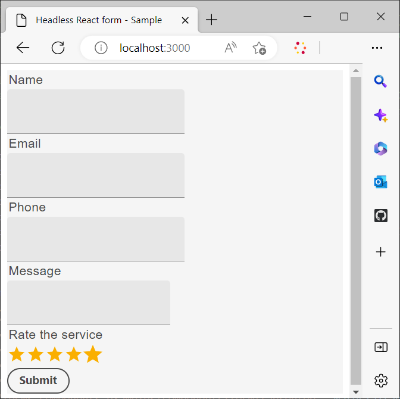

# Använd ett anpassat reaktionsbibliotek för att återge ett headless-formulär

Du kan skapa och implementera anpassade komponenter för att anpassa utseendet och funktionaliteten (beteendet) för dina formulär utan Headless-funktioner enligt organisationens krav och riktlinjer.

De här komponenterna har två primära syften: att styra utseendet eller formatet på formulärfält och att lagra data som samlats in via dessa fält i formulärmodellinstansen. Om det här låter förvirrande, var inte orolig - vi kommer snart att gå igenom dessa syften i detalj. Nu ska vi fokusera på de inledande stegen för att skapa anpassade komponenter, återge formuläret med dessa komponenter och använda händelser för att spara och skicka data till en REST-slutpunkt.

I den här självstudiekursen används komponenter i användargränssnittet för Google-material för att visa hur du återger ett Headless-formulär med anpassade React-komponenter. Du är dock inte begränsad till det här biblioteket och kan använda React Components Library eller utveckla egna anpassade komponenter.

När den här artikeln är avslutad omvandlas formuläret _Kontakta oss_ som skapats i [Skapa och publicera ett headless-formulär med hjälp av startkit](create-and-publish-a-headless-form.md) till följande:




De största stegen som krävs för att återge ett formulär med hjälp av användargränssnittskomponenterna för Google-material är:


## 1. Installera Google Material UI

Som standard använder startsatsen [Adobe Spectrum](https://spectrum.adobe.com/) -komponenter. Låt oss ange att [Google-materialets användargränssnitt](https://mui.com/) ska användas:

1. Kontrollera att startpaketet inte körs. Om du vill stoppa startsatsen öppnar du terminalen, navigerar till **responsstarter-kit-aem-headless-forms** och trycker på Ctrl-C (samma i Windows, Mac &amp; Linux).

   Försök inte stänga terminalen. När du stänger terminalen stoppas inte startsatsen.

1. Kör följande kommando:

```shell
    
    npm install @mui/material @emotion/react @emotion/styled --force
    
```

Det installerar Google Material UI npm-biblioteken och lägger till biblioteken i startkit-beroenden. Nu kan du använda materialgränssnittskomponenter för att återge formulärkomponenter.


## 2. Skapa anpassade React-komponenter

Låt oss skapa en anpassad komponent som ersätter standardkomponenten för [textindata](https://spectrum.adobe.com/page/text-field/) med komponenten [Google-textfält för material](https://mui.com/material-ui/react-text-field/).

En separat komponent krävs för varje komponenttyp ([fieldType](https://opensource.adobe.com/aem-forms-af-runtime/storybook/?path=/story/reference-json-properties-fieldtype--text-input) eller :type) som används i en Headless-formulärdefinition. I formuläret Kontakta oss som du skapade i föregående avsnitt är till exempel fälten Namn, E-post och Telefon av typen `text-input` ([fieldType: &quot;text-input&quot;](https://opensource.adobe.com/aem-forms-af-runtime/storybook/?path=/docs/adaptive-form-components-text-input-field--def)) och meddelandefältet av typen `multiline-input` ([&quot;fieldType&quot;: &quot;multiline-input&quot;](https://opensource.adobe.com/aem-forms-af-runtime/storybook/?path=/docs/reference-json-properties-fieldtype--multiline-input)).


Låt oss skapa en anpassad komponent för att täcka över alla formulärfält som använder egenskapen [fieldType: &quot;text-input&quot;](https://opensource.adobe.com/aem-forms-af-runtime/storybook/?path=/docs/adaptive-form-components-text-input-field--def) med komponenten [Material UI Text Field](https://mui.com/material-ui/react-text-field/) .


Så här skapar du den anpassade komponenten och mappar den anpassade komponenten med egenskapen [fieldType](https://opensource.adobe.com/aem-forms-af-runtime/storybook/?path=/docs/adaptive-form-components-text-input-field--def) :

1. Öppna katalogen **response-starter-kit-aem-headless-forms** i en kodredigerare och navigera till `\react-starter-kit-aem-headless-forms\src\components`.


1. Skapa en kopia av mappen **slider** eller **richtext** och byt namn på den kopierade mappen till **materialtextfield**. Slider och richtext är två exempel på anpassade komponenter som är tillgängliga i startappen. Du kan använda dessa för att skapa egna anpassade komponenter.

   

1. Öppna filen `\react-starter-kit-aem-headless-forms\src\components\materialtextfield\index.tsx` och ersätt den befintliga koden med koden nedan. Den här koden returnerar och återger en [Google-textfältskomponent för materialgränssnitt](https://mui.com/material-ui/react-text-field/) .

```JavaScript
 
     import React from 'react';
     import {useRuleEngine} from '@aemforms/af-react-renderer';
     import {FieldJson, State} from '@aemforms/af-core';
     import { TextField } from '@mui/material';
     import Box from '@mui/material/Box';
     import { richTextString } from '@aemforms/af-react-components';
     import Typography from '@mui/material/Typography';


     const MaterialtextField = function (props: State<FieldJson>) {

         const [state, handlers] = useRuleEngine(props);

         return(

         <Box>
             <Typography component="legend">{state.visible ? richTextString(state?.label?.value): ""} </Typography>
             <TextField variant="filled"/>
         </Box>

         )
     }

     export default MaterialtextField;
```


Delen `state.visible` kontrollerar om komponenten är inställd på att vara synlig. Om den är det hämtas etiketten för fältet och visas med `richTextString(state?.label?.value)`.


Din anpassade komponent `materialtextfield` är klar. Låt oss ställa in den här anpassade komponenten så att den ersätter alla förekomster av [fieldType: &quot;text-input&quot;](https://opensource.adobe.com/aem-forms-af-runtime/storybook/?path=/docs/adaptive-form-components-text-input-field--def) med Google materialgränssnittets textfält.

## 3. Mappa en anpassad komponent med headless-formulärfält

Processen med att återge formulärfält med hjälp av bibliotekskomponenter från tredje part kallas för mappning. Du mappar varje ([fieldType](https://opensource.adobe.com/aem-forms-af-runtime/storybook/?path=/story/reference-json-properties-fieldtype--text-input)) till motsvarande komponent i ett tredjepartsbibliotek.

All mappningsrelaterad information läggs till i filen `mappings.ts`. Programsatsen `...mappings` i filen `mappings.ts` refererar till standardmappningarna, som överlappar ([fieldType](https://opensource.adobe.com/aem-forms-af-runtime/storybook/?path=/story/reference-json-properties-fieldtype--text-input) eller :type) med [Adobe Spectrum](https://spectrum.adobe.com/page/text-field/) -komponenter.

Så här lägger du till mappning för komponenten `materialtextfield` som skapades i det senaste steget:

1. Öppna filen `mappings.ts`.

1. Lägg till följande import-sats för att inkludera komponenten `materialtextfield` i filen `mappings.ts`:


   ```JavaScript
       import MaterialtextField from "../components/materialtextfield";
   ```

1. Lägg till följande programsats för att mappa `text-input` med materialtextfältskomponenten.


   ```JavaScript
       "text-input": MaterialtextField
   ```

   Den slutliga koden för filen ser ut så här:

   ```JavaScript
         import { mappings } from "@aemforms/af-react-components";
         import MaterialtextField from "../components/materialtextfield";
   
   
         const customMappings: any = {
           ...mappings,
           "text-input": MaterialtextField
        };
        export default customMappings;
   ```

1. Spara och kör programmet. De tre första fälten i formuläret återges med [Google-textfält för materialgränssnitt](https://mui.com/material-ui/react-text-field/):

   


   På samma sätt kan du skapa anpassade komponenter för meddelanderutorna (&quot;fieldType&quot;: &quot;multiline-input&quot;) och betygsätta tjänstefälten (&quot;fieldType&quot;:&quot;number-input&quot;). Du kan klona följande Git-databas för anpassade meddelandekomponenter och betygsätta tjänstfälten:

   [https://github.com/singhkh/react-starter-kit-aem-headless-forms](https://github.com/singhkh/react-starter-kit-aem-headless-forms)

## Nästa steg

Du har återgett formuläret med anpassade komponenter som använder Google materialgränssnitt. Har du försökt skicka in formuläret genom att klicka på Skicka-knappen (mappad med motsvarande Google-materialgränssnittskomponent)? Om inte, försök då.

Skickar formuläret data till någon datakälla? Nej? Oroa dig inte. Detta beror på att formuläret inte har konfigurerats för att kommunicera med körningsbiblioteket.

Hur kan du konfigurera formuläret så att det kan kommunicera med det? Vi har en artikel på gång som kommer att förklara allt i detalj. Stanna kvar på kanalen!
